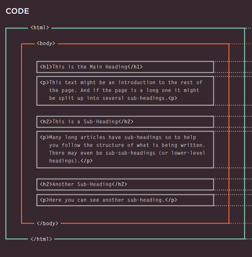
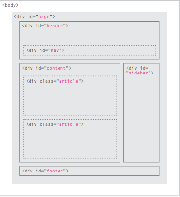
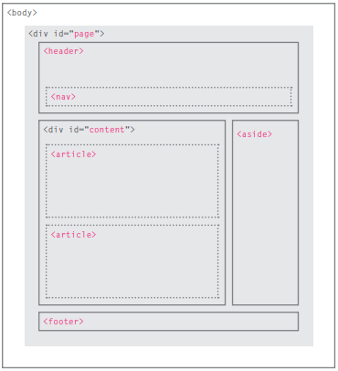
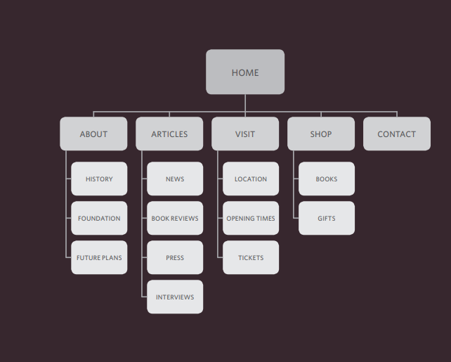
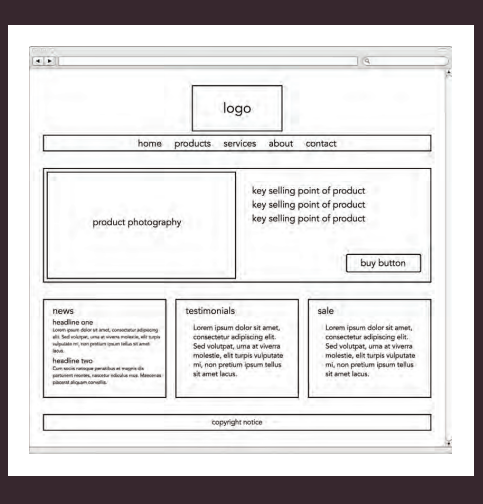

#  **Introduction to HTML:**

## HTML stands for Hyper Text Markup Language. 
The HTML is a markup language which is used by the browser to manipulate text, images and other content to display it in required format.

How People Access the Web: s it is important to consider the different ways in which people access the web and clarify some terminology.

* **Browsers:**
 People access websites using software called a web browser. Popular examples include Firefox, Internet Explorer, Safari, Chrome, and Opera. In order to view a web page, users might type a web address into their browser, follow a link from another site, or use a bookmark.

* **Web Servers:**
 When you ask your browser for a web page, the request is sent across the Internet to a special computer known as a web server which hosts the website. Web servers are special computers that are constantly connected to the Internet, and are optimized to send web pages out to people who request them.

 * **Screen readers:**
 Screen readers are programs that read out the contents of a computer screen to a user. They are commonly used by people with visual impairments.

### How Websites Are Created?

 All websites use HTML and CSS, but content management systems, blogging software, and e-commerce platforms often add a few more technologies into the mix.

 ***What you see?***

 When you are looking at a website, it is most likely that your browser will be receiving HTML and CSS from the web server that hosts the site. The web browser interprets the HTML and CSS code to create the page that you see.

***How it is created?***

Small websites are often written just using HTML and CSS. Larger websites — in particular those that are updated regularly and use a content management system (CMS), blogging tools, or e-commerce software — often make use of more complex technologies on the web server.

### HTML5 & CSS3:
 Since the web was first created there have been several versions of HTML and CSS — each intended to be an improvement on the previous version.

 Since the web was first created there have been several versions of HTML and CSS — each intended to be an improvement on the previous version.

***How the Web Works:***

When you visit a website, the web server hosting that site could be anywhere in the world. In order for you to find the location of the web server, your browser will first connect to a Domain Name System (DNS) server.

1.	When you connect to the web, you do so via an Internet Service Provider (ISP). You type a domain name or web address into your browser to visit a site; for example: google.com, bbc.co.uk, microsoft.com.

2.	Your computer contacts a network of servers called Domain Name System (DNS) servers. These act like phone books; they tell your computer the IP address associated with the requested domain name. An IP address is a number of up to 12 digits separated by periods / full stops. Every device connected to the web has a unique IP address; it is like the phone number for that computer.

3.	The unique number that the DNS server returns to your computer allows your browser to contact the web server that hosts the website you requested. A web server is a computer that is constantly connected to the web, and is set up especially to send web pages to users.

4.	The web server then sends the page you requested back to your web browser.

# **Structure of HTML pages:**

How Pages Use Structure: Think about the stories you read in a newspaper: for each story, there will be a headline, some text, and possibly some images. If the article is a long piece, there may be subheadings that split the story into separate sections or quotes from those involved. Structure helps readers understand the stories in the newspaper.

* HTML Uses Elements to Describe the Structure of Pages: Each element has an opening tag and a closing tag.

Tags act like containers. They tell you something about the information that lies between their opening and closing tags.

A Closer Look at Tags for example the (P) tag
First we have the opening tag which is  the characters in the brackets indicate the tag's purpose. For example, in the tags above the p stands for paragraph. Then we have the closing tag with a forward slash after the < symbol.

## ***Structure details of HTML: Body, Head & Title.***

* **Body:** You met the body Element in the first example we created. Everything inside this element is shown inside the main browser window.

* **Head:** Before the body element you will often see a head element. This contains information about the page (rather than information that is shown within the main part of the browser window that is highlighted in blue on the opposite page). You will usually find a title element inside the head element.

* **Title:** The contents of the title element are either shown in the top of the browser, above where you usually type in the URL of the page you want to visit, or on the tab for that page (if your browser uses tabs to allow you to view multiple pages at the same time).

### **Summary**

1.	HTML pages are text documents.

2.	HTML uses tags (characters that sit inside angled brackets) to give the information they surround special meaning.

3.	Tags are often referred to as elements.

4.	Tags usually come in pairs. The opening tag denotes the start of a piece of content; the closing tag denotes the end.

5.	Opening tags can carry attributes, which tell us more about the content of that element.

6.	Attributes require a name and a value.

7.	To learn HTML you need to know what tags are available for you to use, what they do, and where they can go.

# **Extra Markup:**

## Identifying and grouping elements:

1.**DOCTYPEs:** Because there have been several versions of HTML, each web page should begin with a DOCTYPE declaration to tell a browser which version of HTML the page is using (although browsers usually display the page even if it is not included).

2. **ID Attribute:** Every HTML element can carry the id attribute. It is used to uniquely identify that element from other elements on the page. Its value should start with a letter or an underscore (not a number or any other character). It is important that no two elements on the same page have the same value for their id attributes (otherwise the value is no longer unique).

3. **Class Attribute:** Every HTML element can also carry a class attribute. Sometimes, rather than uniquely identifying one element within a document, you will want a way to identify several elements as being different from the other elements on the page.

4. **Block Elements:** Some elements will always appear to start on a new line in the browser window. These are known as block level elements. Examples of block elements (h1, p, ul, li).

5. **Inline Elements:** Some elements will always appear to continue on the same line as their neighboring elements. These are known as inline elements. Examples of inline elements are (a, b, em and img).

## Grouping Text & Elements in a Block
The div element allows you to group a set of elements together in one block-level box.

## Grouping Text & Elements Inline span

The element acts like an inline equivalent of the div element. It is used to either:
 1. Contain a section of text where there is no other suitable element to differentiate it from its surrounding text .

2. Contain a number of inline elements.
 The most common reason why people use the span elements is so that they can control the appearance of the content of these elements using CSS.

## Comments, Meta information and iframes:

 * **Iframes:** An iframe is like a little window that has been cut into your page — and in that window you can see another page. The term iframe is an abbreviation of inline frame. One common use of iframes (that you may have seen on various websites) is to embed a Google Map into a page. The content of the iframe can be any html page (either located on the same server or anywhere else on the web).

 * **Comments in HTML:**
If you want to add a comment to your code that will not be visible in the user's browser, you can add the text between these characters:
 <! - - comments goes here - ->

 * **Meta:** The Meta element lives inside the element and contains information about that web page. It is not visible to users but fulfills a number of purposes such as telling search engines about your page, who created it, and whether or not it is time sensitive.

# **HTML5 Layout:**
  HTML5 is introducing a new set of elements that help define the structure of a page.

  There is two types of layout:
  1. **Traditional HTML Layouts:**

  

2. **New Html5 Layout Elements:**

## Headers & Footers:

The header and footer elements can be used for:
 The main header or footer that appears at the top or bottom of every page on the site.

 A header or footer for an individual article or section within the page.

Navigation nav: The nav element is used to contain the major navigational blocks on the site such as the primary site navigation.
Articles: The article element acts as a container for any section of a page that could stand alone and potentially be syndicated. This could be an individual article or blog entry, a comment or forum post, or any other independent piece of content.

### Summary

1.	The new HTML5 elements indicate the purpose of different parts of a web page and help to describe its structure.

2.	The new elements provide clearer code (compared with using multiple div elements).

3.	Older browsers that do not understand HTML5 elements need to be told which elements are block-level elements.

4.	To make HTML5 elements work in Internet Explorer 8 (and older versions of IE), extra JavaScript is needed, which is available free from Google.

# **Process & Design:**

***Who is the Site For?*** 

Every website should be designed for the target audience—not just for yourself or the site owner. It is therefore very important to understand who your target audience is.

***Why People Visit YOUR Website?***

Now that you know who your visitors are, you need to consider why they are coming. While some people will simply chance across your website, most will visit for a specific reason.

* Your content and design should be influenced by the goals of your users. To help determine why people are coming to your website, there are two basic categories of questions you can ask: 

1.	 The first attempts to discover the underlying motivations for why visitors come to the site. 

2.	 The second examines the specific goals of the visitors. These are the triggers making them come to the site now.

***What Your Visitors are trying to Achieve?***

It is unlikely that you will be able to list every reason why someone visits your site but you are looking for key tasks and motivations. This information can help guide your site designs.

**Site Maps:** Now that you know what needs to appear on your site, you can start to organize the information into sections or pages.

Wireframes: A wireframe is a simple sketch of the key information that needs to go on each page of a site. It shows the hierarchy of the information and how much space it might require.

### Summary:

1.	It's important to understand who your target audience is, why they would come to your site, what information they want to find and when they are likely to return.

2.	Site maps allow you to plan the structure of a site.

3.	Wireframes allow you to organize the information that will need to go on each page.

4.	Design is about communication. Visual hierarchy helps visitors understand what you are trying to tell them.

5.	You can differentiate between pieces of information using size, color, and style.
6.	You can use grouping and similarity to help simplify the information you present.

# **Introduction to JAVASCRIPT:**

## **JavaScript**

JavaScript is a programming language commonly used in web development It was originally developed by Netscape as a means to add dynamic and interactive elements to websites. While JavaScript is influenced by Java, the syntax is more similar to C and is based on ECMAScript, a scripting language developed by Sun Microsystems.

***How JAVASCRIPT makes web pages more interactive?***

* Access content: you can use JavaScript to select any element or text from an HTML page.

* Modify content: you can add elements or text to the page or remove them.

* Program rules: you can specify a set of steps for the browser to follow which allows it to access or change the content of the page.
The ABC of programming:

***A: What is a script and how do I create one?***

A script is a series of instructions that a computer can follow to achieve a goal. You could compare scripts to any of the following:

1. RECIPES by following the instructions in a recipe, one-by-one in the order set out, cooks can create a dish they have never made before.

2.	HANDBOOKS Large companies often provide handbooks for new employees that contain procedures to follow in certain situations.

3.	MANUALS Mechanics often refer to car repair manuals when servicing models they are not familiar with. These manuals contain a series of tests to check the key functions of the car are working, along with details of how to fix any issues that arise.

WRITING A SCRIPT: To write a script, you need to first state your goal and then list the tasks that need to be completed in order to achieve it.

1.	1: DEFINE THE GOAL First, you need to define the task you want to achieve. You can think of this as a puzzle for the computer to solve.

2.	2: DESIGN THE SCRIPT to design a script you split the goal out into a series of tasks that are going to be involved in solving this puzzle. This can be represented using a flowchart.

3.	CODE EACH STEP each of the steps needs to be written in a programming language that the computer understands. In our case, this is JavaScript.

### Summary

* A script is a series of instructions that the computer can follow in order to achieve a goal.

* Each time the script runs, it might only use a subset of all the instructions.

* Computers approach tasks in a different way than humans, so your instructions must let the computer solve the task programmatically.

* To approach writing a script, break down your goal into a series of tasks and then work out each step needed to complete that task (a flowchart can help).

***B: How do computers fit in with the world around them?***

COMPUTERS CREATE MODELS OF THE WORLD USING DATA:

Here is a model of a hotel, along with some model trees, model people, and model cars. To a human, it is clear what kind of real-world object each one represents.

A computer has no predefined concept of what a hotel or car is. It does not know what they are used for. Your laptop or phone will not have a favorite brand of car, nor will it know what star rating your hotel is.

**OBJECTS & PROPERTIES:**

**OBJECTS** (TH INGS) in computer programming, each physical thing in the world can be represented as an object. There are two different types of objects here: a hotel and a car.

**PROPERTIES** (CHARACTERISTICS) Both of the cars share common characteristics. In fact, all cars have a make, a color, and engine size. You could even determine their current speed. Programmers call these characteristics the properties of an object.

**EVENTS**: in the real world, people interact with objects. These interactions can change the values of the properties in these objects.

***WHAT IS AN EVENT?***

 There are common ways in which people interact with each type of object. For example, in a car a driver will typically use at least two pedals. The car has been designed to respond differently when the driver interacts with each of the different pedals:

* The accelerator makes the car go faster.

* The brake slows it down.

***WHAT DOES AN EVENT DO?***

 Programmers choose which events they respond to. When a specific event happens, that event can be used to trigger a specific section of the code.

**METHODS:** Methods represent things people need to do with objects. They can retrieve or update the values of an object's properties.

***WHAT IS A METHOD?*** 

Methods typically represent how people (or other things) interact with an object in the real world.

WHAT DOES A METHOD DO? The code for a method can contain lots of instructions that together represent one task.

PUTTING IT ALL TOGETHER: Computers use data to create models of things in the real world. The events, methods, and properties of an object all relate to each other: Events can trigger methods, and methods can retrieve or update an object's properties.
HOW A BROWSER SEES A WEB PAGE?

1.	 RECEIVE A PAGE AS HTML CODE

2.	CREATE A MODEL OF THE PAGE AND STORE IT IN MEMORY

3.	USE A RENDERING ENGINE TO SHOW THE PAGE ON SCREEN

***C: How do I write a script for a web page?***

HOW HTML, CSS, & JAVASCRIPT FIT TOGETHER?

**HTML:** CONTENT LAYER. Html files this is where the content of the page lives. The HTML gives the page structure and adds semantics.

**CSS:** PRESENTATION LAYER. css files The CSS enhances the HTML page with rules that state how the HTML content is presented (backgrounds, borders, box dimensions, colors, fonts, etc.).

**JavaScript:** BEHAVIOR LAYER .js files this is where we can change how the page behaves, adding interactivity. We will aim to keep as much of our JavaScript as possible in separate files.

JAVASCRIPT RUNS WHERE IT IS FOUND IN THE HTML:

When the browser comes across a script element, it stops to load the script and then checks to see if it needs to do anything.

### Summary:

1. It is best to keep JavaScript code in its own JavaScript file.

2. JavaScript files are text files (like HTML pages and CSS style sheets), but they have them. js extension.

3. If you view the source code of the page in the browser, the JavaScript will not have changed the HTML, because the script works with the model of the web page that the browser has created.
