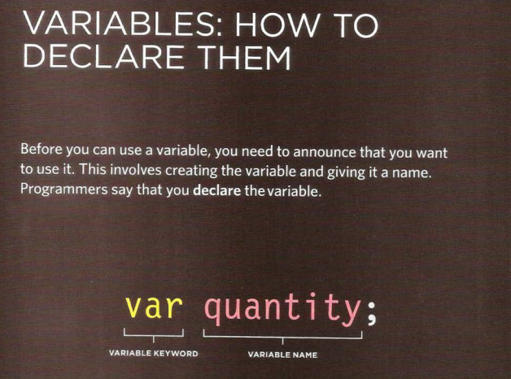

# Text

When creating a web page, you add tags (known as markup) to the contents of the page. These tags provide extra meaning and allow browsers to show users the appropriate structure for the page.

● Structural markup: the elements that you can use to describe both headings and paragraphs

● Semantic markup: which provides extra information; such as where emphasis is placed in a sentence, that something you have written is a quotation (and who said it), the meaning of acronyms, and so on.

**Headings:** HTML has six "levels" of headings Browsers display the contents of headings at different sizes. The contents of an (h1) element is the largest, and the contents of (h6) an element is the smallest.
**Paragraphs:** To create a paragraph, surround the words that make up the paragraph with an opening P tag and closing P tag.

**Bold & Italic:**
By enclosing words in the tags b we can make characters appear bold.

The b element also represents a section of text that would be presented in a visually different way (for example key words in a paragraph) although the use of the b element does not imply any additional meaning.

By enclosing words in the tags i and we can make characters appear italic. The element also represents a section of text that would be said in a different way from surrounding content.

**Superscript & Subscript**

***Sup:*** element is used to contain characters that should be superscript such as the suffixes of dates or mathematical concepts like raising a number to a power.

***Sub:*** element is used to contain characters that should be subscript. It is commonly used with foot notes or chemical formulas such as H2O.

**Line Breaks & Horizontal Rules**

**Br:** As you have already seen, the browser will automatically show each new paragraph or heading on a new line. But if you wanted to add a line break inside the middle of a paragraph you can use the line break tag

**Hr:** To create a break between themes — such as a change of topic in a book or a new scene in a play — you can add a horizontal rule between sections

***Semantic Markup:*** There are some text elements that are not intended to affect the structure of your web pages, but they do add extra information to the pages — they are known as semantic markup.

**Strong & Emphasis**

**Strong:** element indicates that its content has strong importance. For example, the words contained in this element might be said with strong emphasis.

**Em:**  element indicates emphasis that subtly changes the meaning of a sentence.

**Quotations:**
***Blockquote:*** element is used for longer quotes that take up an entire paragraph.

***q:*** element is used for shorter quotes that sit within a paragraph. Browsers are supposed to put quotes around the element, however Internet Explorer does not — therefore many people avoid using the element.

**Abbreviations & Acronyms:**

***Abbr:*** If you use an abbreviation or an acronym, then the element can be used. A title attribute on the opening tag is used to specify the full term.

**Citations & Definitions**

***Cite:*** When you are referencing a piece of work such as a book, film or research paper, the element can be used to indicate where the citation is from.

***Dfn:*** The first time you explain some new terminology (perhaps an academic concept or some jargon) in a document, it is known as the defining instance of it.

The element is used to indicate the defining instance of a new term.

***Changes to Content:***

***Ins, del:*** The ins element can be used to show content that has been inserted into a document, while the del element can show text that has been deleted from it. The content of a ins element is usually underlined, while the content of a del element usually has a line through it

***S element:*** element indicates something that is no longer accurate or relevant (but that should not be deleted). Visually the content of an element will usually be displayed with a line through the center.

### Summary

1. HTML elements are used to describe the structure of the page (e.g. headings, subheadings, paragraphs).

2. They also provide semantic information (e.g. where emphasis should be placed, the definition of any acronyms used, when given text is a quotation).

# Introducing CSS

**What CSS?**

**Does How CSS works?**

**Rules, properties, and values?**

CSS allows you to create rules that specify how the content of an element should appear. For example, you can specify that the background of the page is cream, all paragraphs should appear in gray using the Arial typeface, or that all level one headings should be in a blue, italic, Times typeface.

### Understanding CSS: Thinking Inside the Box

* The key to understanding how CSS works is to imagine that there is an invisible box around every HTML element.

* CSS allows you to create rules that control the way that each individual box (and the contents of that box) is presented.

### CSS Associates Style rules with HTML elements

### CSS Properties Affect How Elements Are Displayed

## There are three ways to use CSS inside an HTML file

1. Inline CSS: here we can use CSS inside the opening tag of an element.

2. Internal CSS: here we can use CSS by using an opening and closing tag of (style).

3. External CSS: here we make a new fill such as style.CSS then link it inside the HTML using (link tag).

**CSS Selectors:** There are many different types of CSS selector that allow you to target rules to specific elements in an HTML document. The table on the opposite page introduces the most commonly used CSS selectors.

### How CSS Rules Cascade

If there are two or more rules that apply to the same element, it is important to understand which will take precedence.

 **LAST RULE** if the two selectors are identical, the latter of the two will take precedence. Here you can see the second i selector takes precedence over the first.

**SPECIFICITY** if one selector is more specific than the others, the more specific rule will take precedence over more general ones.

**IMPORTANT** you can add! Important after any property value to indicate that it should be considered more important than other rules that apply to the same element.

### Summary

1. CSS treats each HTML element as if it appears inside its own box and uses rules to indicate how that element should look.

2. Rules are made up of selectors (that specify the elements the rule applies to) and declarations (that indicate what these elements should look like).

3. Different types of selectors allow you to target your rules at different elements.

4. Declarations are made up of two parts: the properties of the element that you want to change, and the values of those properties. For example, the font-family property sets the choice of font, and the value Arial specifies Arial as the preferred typeface.

5. CSS rules usually appear in a separate document, although they may appear within an HTML page.

# Basic JavaScript instructions

**STATEMENTS:** A script is a series of instructions that a computer can follow one-by-one. Each individual instruction or step is known as a statement. Statements should end with a semicolon.

**COMMENTS:** You should write comments to explain what your code does. They help make your code easier to read and understand. This can help you and others who read your code.

***Types of comments:***

1. **MULTI-LINE COMMENTS** to write a comment that stretches over more than one line, you use a multi-line comment, starting with the /*characters and ending with the*/ characters. Anything between these characters is not processed· by the JavaScript interpreter.

2. **SINGLE-LINE COMMENTS** In a single-line comment, anything that follows the two forward slash characters I/ on that line will not be processed by the JavaScript interpreter. Single line comments are often used for short descriptions of what the code is doing.

**WHAT IS A VARIABLE?**

A script will have to temporarily store the bits of information it needs to do its job. It can store this data in variables.

A variable is a good name for this concept because the data stored in a variable can change (or vary) each time a script runs.

### **DATA TYPES:** JavaScript distinguishes between numbers, strings, and true or false values known as Booleans

1. NUMERIC DATA TYPE The numeric data type handles numbers.

2. STRING DATA TYPE The strings data type consists of letters and other characters.

3. BOOLEAN DATA TYPE Boolean data types can have one of two values: true or false.

### SHORTHAND FOR CREATING VARIABLES

### RULES FOR NAMING VARIABLES

1. The name must begin with a letter, dollar sign ($), or an underscore (_). It must not start with a number.

2. The name can contain letters, numbers, dollar sign ($), or an underscore (_). Note that you must not use a dash (-) or a period (.) in a variable name.

3. You cannot use keywords or reserved words. Keywords are special words that tell the interpreter to do something. For example, var is a keyword used to declare a variable. Reserved words are ones that may be used in a future version of JavaScript.

4. All variables are case sensitive, so score and Score would be different variable names, but it is bad practice to create two variables that have the same name using different cases.

5. Use a name that describes the kind of information that the variable stores. For example, first Name might be used to store a person's first name, last Name for their last name, and age for their age.

6. If your variable name is made up of more than one word, use a capital letter for the first letter of every word after the first word.

**ARRAYS:** An array is a special type of variable. It doesn't just store one value; it stores a list of values.

**VALUES IN ARRAYS:** Values in an array are accessed as if they are in a numbered list. It is important to know that the numbering of this list starts at zero (not one).

**EXPRESSIONS:** An expression evaluates into (results in) a single value. Broadly speaking there are two types of expressions.

1. ***EXPRESSIONS*** THAT JUST ASSIGN A VALUE TO A VARIABLE In order for a variable to be useful, it needs to be given a value. As you have seen, this is done using the assignment operator (the equals sign).

2. ***EXPRESSIONS THAT*** USE TWO OR MORE VALUES TO RETURN A SINGLE VALUE you can perform operations on any number of individual values (see next page) to determine a single value.

**OPERATORS:** Expressions rely on things called operators; they allow programmers to create a single value from one or more values.

1. ***ARITHMETIC OPERATORS JavaScript contains the following mathematical operators, which you can use with numbers. You may remember some from math class.***

2. ***STRING OPERATOR There is just one string operator: the+ symbol. It is used to join the strings on either side of it.***

### Summary

1. A script is made up of a series of statements. Each statement is like a step in a recipe.

2. Scripts contain very precise instructions. For example, you might specify that a value must be remembered before creating a calculation using that value.

3. Variables are used to temporarily store pieces of information used in the script.

4. Arrays are special types of variables that store more than one piece of related information.

5. JavaScript distinguishes between numbers (0-9), strings (text), and Boolean values (true or false).

6. Expressions evaluate into a single value.

7. Expressions rely on operators to calculate a value.

# Decisions and loops

**What is decisions?**

DECISIONS using the results of evaluations, you can decide which path your script should go down.

**What is loop?**

loop is a control flow statement that iterates a part of the programs multiple times. The Java while loop is a control flow statement that executes a part of the programs repeatedly on the basis of given boolean condition.

LOOPS There are also many occasions where you will want to perform the same set of steps repeatedly.

Evaluating decisions and conditional statement:

Comparison operators: evaluating conditions

Logical operators:

