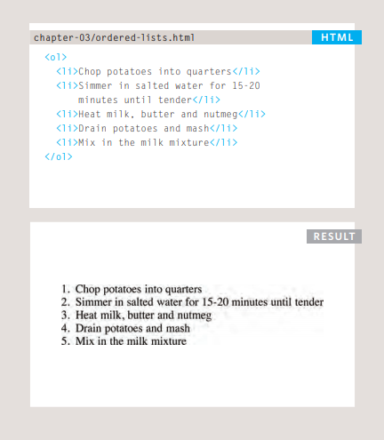
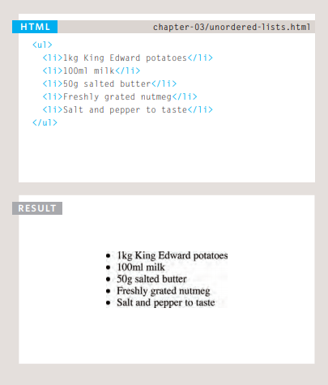
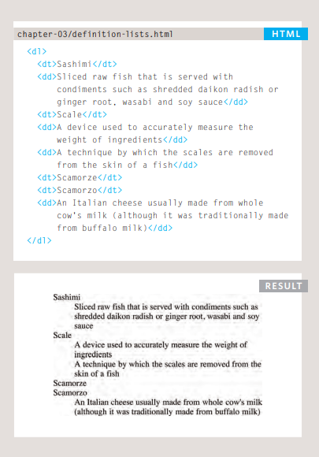
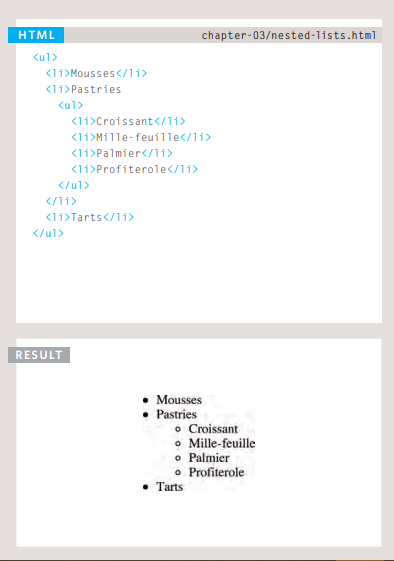

# HTML Lists, Control Flow with JS, and the CSS Box Model

## Lists

There are lots of occasions when we need to use lists. HTML provides us with three different types:

● Ordered lists are lists where each item in the list is numbered. For example, the list might be a set of steps for a recipe that must be performed in order, or a legal contract where each point needs to be identified by a section number.

The ordered list is created with the **ol** element.

**li** Each item in the list is placed between an opening **li** tag and a closing **/li** tag. (The li stands for list item.)

● Unordered lists are lists that begin with a bullet point (rather than characters that indicate order)

**ul** The unordered list is created with the **ul** element.

**li** Each item in the list is placed between an opening **li** tag and a closing **/li** tag. (The li stands for list item.)

• Definition lists are made up of a set of terms along with the definitions for each of those terms.

**dl**
The definition list is created with the **dl** element and usually consists of a series of terms and their definitions.
Inside the **dl** element you will usually see pairs of **dt** and
**dd** elements.

**dt** This is used to contain the term being defined (the definition term).

**dd** This is used to contain the definition.

Nested lists
You can put a second list inside an **li** element to create a sub list or nested list.

### Summary

1. There are three types of HTML lists: ordered, unordered, and definition.

2. Ordered lists use numbers.

3. Unordered lists use bullets.

4. Definition lists are used to define terminology.

5. Lists can be nested inside one another.

## Boxes

### Box Dimensions: width, height

By default a box is sized just big enough to hold its contents. To set your own dimensions for a box you can use the height and width properties.

The most popular ways to specify the size of a box are to use pixels, percentages, or ems. Traditionally, pixels have been the most popular method because they allow designers to accurately control their size.

### Limiting width: min-width, max-width

Some page designs expand and shrink to fit the size of the user's screen. In such designs, the min-width property specifies the smallest size a box can be displayed at when the browser window is narrow, and the max-width property indicates the maximum width a box can stretch to when the browser window is wide.

### Limiting Height: min-height, max-height

In the same way that you might want to limit the width of a box on a page, you may also want to limit the height of it. This is achieved using the min-height and max-height properties.

### Overflowing content

Overflow: The overflow property tells the browser what to do if the content contained within a box is larger than the box itself. It can have one of two values:

1. Hidden this property simply hides any extra content that does not fit in the box.

2. Scroll this property adds a scrollbar to the box so that users can scroll to see the missing content.

### Border, Margin & Padding:

 Every box has three available properties that can be adjusted to control its appearance:

1.	Border Every box has a border (even if it is not visible or is specified to be 0 pixels wide). The border separates the edge of one box from another.

2.	Margin Margins sit outside the edge of the border. You can set the width of a margin to create a gap between the borders of two adjacent boxes.

3.	Padding Padding is the space between the border of a box and any content contained within it. Adding padding can increase the readability of its contents.

