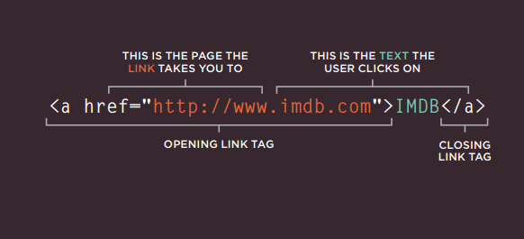
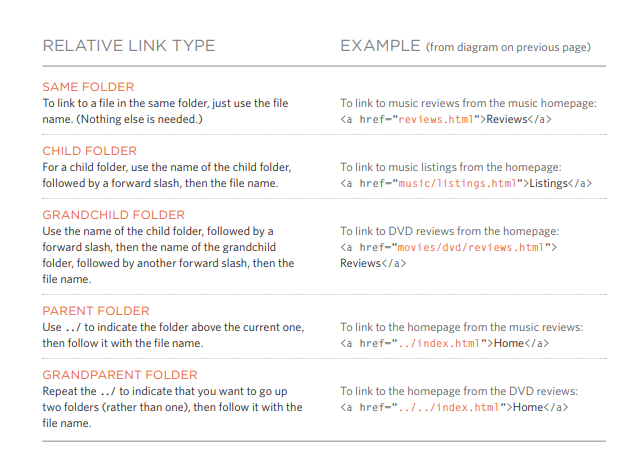
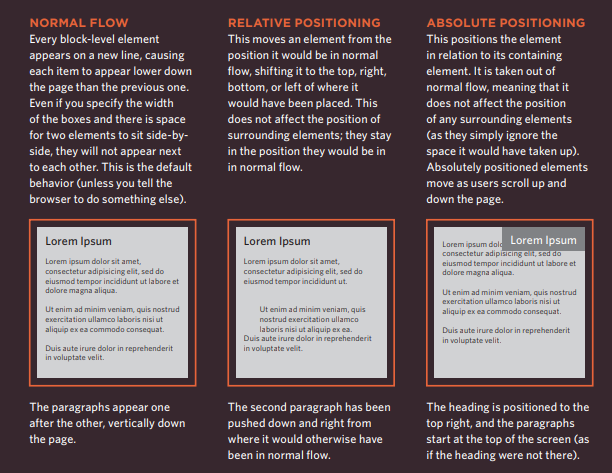
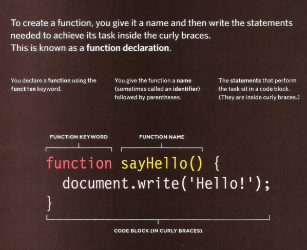
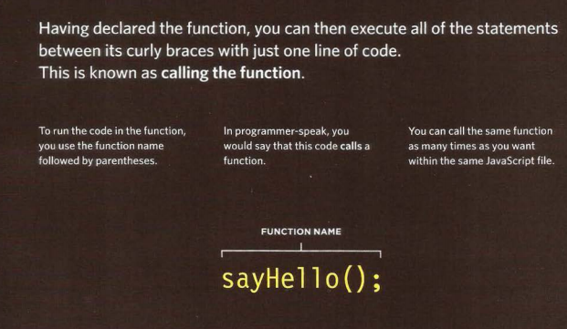
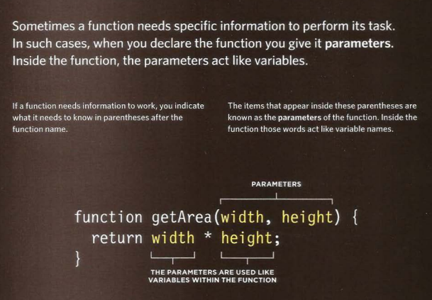
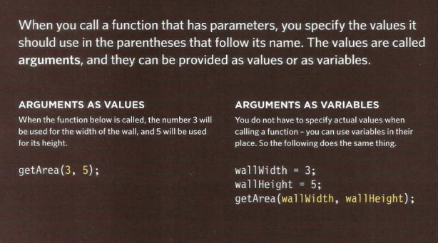
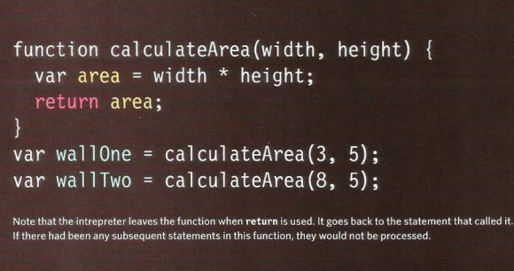
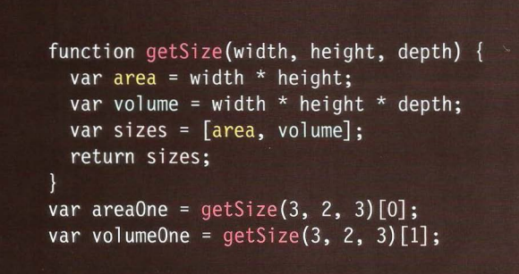

# HTML Links, JS Functions, and Intro to CSS Layout

## Links

Links are the defining feature of the web because they allow you to move from one web page to another — enabling the very idea of browsing or surfing.

### Writing Links:

Links are created using the element. Users can click on anything between the opening tag and the closing tag. You specify which page you want to link to using the href attribute.

  

### Linking to Other Sites:

Links are created using the element which has an attribute called href. The value of the href attribute is the page that you want people to go to when they click on the link.

When you link to a different website, the value of the href attribute will be the full web address for the site, which is known as an absolute URL.

### Linking to Other Pages on the Same Site:

When you are linking to other pages within the same site, you do not need to specify the domain name in the URL. You can use a shorthand known as a relative URL.

If all the pages of the site are in the same folder, then the value of the href attribute is just the name of the file.

### Directory Structure:

On larger websites it's a good idea to organize your code by placing the pages for each different section of the site into a new folder. Folders on a website are sometimes referred to as directories.

1. **Structure** The diagram on the right shows the directory structure for a fictional entertainment listings website called Example Arts.

2. **Relationships** the relationship between files and folders on a website is described using the same terminology as a family tree.

3. **Homepages** The main homepage of a site written in HTML (and the homepages of each section in a child folder) is called index.html.

### Relative URLs:

Relative URLs can be used when linking to pages within your own website. They provide a shorthand way of telling the browser where to find your files.

When you are linking to a page on your own website, you do not need to specify the domain name. You can use relative URLs which are a shorthand way to tell the browser where a page is in relation to the current page.

  

### Email Links:

**Mailto:** To create a link that starts up the user's email program and addresses an email to a specified email address, you use the element. However, this time the value of the href attribute starts with mailto: and is followed by the email address you want the email to be sent to.

### Opening Links in a New Window:

**Target:** If you want a link to open in a new window, you can use the target attribute on the opening tag. The value of this attribute should be _blank.

One of the most common reasons a web page author might want a link to be opened in a new window is if it points to another website. In such cases, they hope the user will return to the window containing their site after finishing looking at the other one.

### Linking to a Specific Part of the Same Page:

Before you can link to a specific part of a page, you need to identify the points in the page that the link will go to. You do this using the id attribute (which can be used on every HTML element). 

The value of the id attribute should start with a letter or an underscore (not a number or any other character) and, on a single page, no two id attributes should have the same value.

### Linking to a Specific Part of another Page:

If you want to link to a specific part of a different page (whether on your own site or a different website) you can use a similar technique.
As long as the page you are linking to has id attributes that identify specific parts of the page, you can simply add the same syntax to the end of the link for that page.

### Summary

1. Links are created using the element.

2. The element uses the href attribute to indicate the page you are linking to.

3. If you are linking to a page within your own site, it is best to use relative links rather than qualified URLs.

4. You can create links to open email programs with an email address in the "to" field.

5. You can use the id attribute to target elements within a page that can be linked to.

## Layout

### Key Concepts in Positioning Elements:

Building Blocks: CSS treats each HTML element as if it is in its own box. This box will either be a block-level box or an inline box.

Block-level boxes start on a new line and act as the main building blocks of any layout, while inline boxes flow between surrounding texts. You can control how much space each box takes up by setting the width of the boxes (and sometimes the height, too). To separate boxes, you can use borders, margins, padding, and background colors.

### Containing Elements

If one block-level element sits inside another block-level element then the outer box is known as the containing or parent element.

It is common to group a number of elements together inside a div (Or other block-level) element. For example, you might group together all of the elements that form the header of a site (such as the logo and the main navigation). The Element that contains this group of elements is then referred to as the containing element.

### Controlling the Position of Elements:

CSS has the following positioning schemes that allow you to control the layout of a page: normal flow, relative positioning, and absolute positioning. You specify the positioning scheme using the position property in CSS. You can also float elements using the float property.

  

To indicate where a box should be positioned, you may also need to use box offset properties to tell the browser how far from the top or bottom and left or right it should be placed. (You will meet these when we introduce the positioning schemes on the following pages.)

### Fixed Positioning:

This is a form of absolute positioning that positions the element in relation to the browser window, as opposed to the containing element. Elements with fixed positioning do not affect the position of surrounding elements and they do not move when the user scrolls up or down the page.

### Floating Elements:

 Floating an element allows you to take that element out of normal flow and position it to the far left or right of a containing box. The floated element becomes a block-level element around which other content can flow.

#### Note:

When you move any element from normal flow, boxes can overlap. The z-index property allows you to control which box appears on top.

## Functions, Methods, and Objects

### WHAT IS A FUNCTION?

Functions let you group a series of statements together to perform a specific task. If different parts of a script repeat the same task, you can reuse the function (rather than repeating the same set of statements).

### Declaring a function:

  

### Calling a function:

  

### Declaring a function that need information:

  

### Calling a function that need information:

  

### Getting a single value out of a function:

  

### Getting multiple values out of a function:

  

### ANONYMOUS FUNCTIONS & FUNCTION EXPRESSIONS:

1. **FUNCTION DECLARATION** a function declaration creates a function that you can call later in your code. It is the type of function you have seen so far in this book.

2. **FUNCTION EXPRESSION** if you put a function where the interpreter would expect to see an expression, then it is treated as an expression, and it is known as a function expression.

### IMMEDIATELY INVOKED FUNCTION EXPRESSIONS:

This way of writing a function is used in several different situations. Often functions are used to ensure that the variable names do not conflict with each other (especially if the page uses more than one script).

IMMEDIATELY INVOKED FUNCTION EXPRESSIONS (llFE) Pronounced "iffy," these functions are not given a name. Instead, they are executed once as the interpreter comes across them.

### VARIABLE SCOPE:

The location where you declare a variable will affect where it can be used within your code. If you declare it within a function, it can only be used within that function. This is known as the variable's scope.

1. LOCAL VARIABLES When a variable is created inside a function using the var keyword, it can only be used in that function. It is called a local variable or function-level variable.

2. GLOBAL VARIABLES If you create a variable outside of a function, then it can be used anywhere within the script. It is called a global variable and has global scope.

### HOW MEMORY & VARIABLES WORK:

1. CREATING THE VARIABLES IN CODE Each variable that you declare takes up memory. The more variables a browser has to remember, the more memory your script requires to run. Scripts that require a lot of memory can perform slower, which in turn makes your web page take longer to respond to the user.

2. NAMING COLLISIONS you might think you would avoid naming collisions; after all you know which variables you are using. But many sites use scripts written by several people. If an HTML page uses two JavaScript files, and both have a global variable with the same name, it can cause errors.
