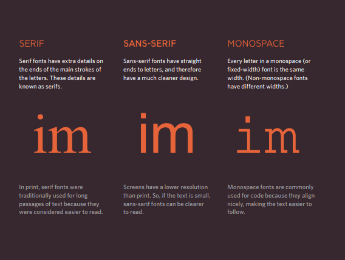
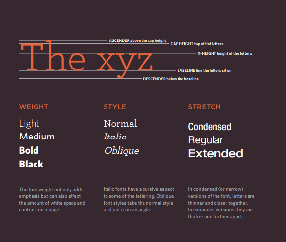
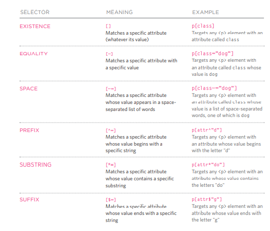

# Images, Color, Text

## Images

There are many reasons why you might want to add an image to a web page: you might want to include a logo, photograph, illustration, diagram, or chart.

### Choosing Images for Your Site:

A picture can say a thousand words, and great images help make the difference between an average-looking site and a really engaging one.
Images should... Be relevant, Convey information, convey the right mood, Be instantly recognizable and Fit the color palette.

### Storing Images on Your Site:

If you are building a site from scratch, it is good practice to create a folder for all of the images the site uses.

### Adding Images:

To add an image into the page you need to use an img element. This is an empty element (which means there is no closing tag). It must carry the following two attributes:

Src: This tells the browser where it can find the image file. This will usually be a relative URL pointing to an image on your own site. (Here you can see that the images are in a child folder called images — relative URLs.

Alt: This provides a text description of the image which describes the image if you cannot see it.

Title: You can also use the title attribute with the specified. Element to provide additional information about the image. Most browsers will display the content of this attribute in a too tip when the user hovers over the image.

### Height & Width of Images:

Height: This specifies the height of the image in pixels.

Width: This specifies the width of the image in pixels.

### Where to Place Images in Your Code:

Where an image is placed in the code will affect how it is displayed. Here are three examples of image placement that produce different results:

1. Before a paragraph the paragraph starts on a new line after the image.

2. Inside the start of a paragraph the first row of text aligns with the bottom of the image.

3. In the middle of a paragraph the image is placed between the words of the paragraph that it appears in.

### Aligning Images Horizontally:

The align attribute was commonly used to indicate how the other parts of a page should flow around an image. It has been removed from HTML5 and new websites should use CSS to control the alignment of images.

**Left:** This aligns the image to the left (allowing text to flow around its right-hand side).

**Right:** This aligns the image to the right (allowing text to flow around its left-hand side).

### Three Rules for Creating Images:

1. Save images in the right format: Websites mainly use images in jpeg, gif, or png format. If you choose the wrong image format then your image might not look as sharp as it should and can make the web page slower to load.

2. Save images at the right size: You should save the image at the same width and height it will appear on the website. If the image is smaller than the width or height that you have specified, the image can be distorted and stretched. If the image is larger than the width and height if you have specified, the image will take longer to display on the page.

3. Use the correct resolution: Computer screens are made up of dots known as pixels. Images used on the web are also made up of tiny dots. Resolution refers to the number of dots per inch, and most computer screens only show web pages at 72 pixels per inch.

### Image Dimensions:

The images you use on your website should be saved at the same width and height that you want them to appear on the page.

1. REDUCING IMAGE SIZE: You can reduce the size of images to create a smaller version of the image.

2. INCREASING IMAGE SIZE: You can't increase the size of photos significantly without affecting the image quality.

3. CHANGING SHAPE: Only some images can be cropped without losing valuable information.

### Transparency:

Creating an image that is partially transparent (or "see-through") for the web involves selecting one of two formats:

1. Transparent GIF: If the transparent part of the image has straight edges and it is 100% transparent (that is, not semi-opaque), you can save the image as a GIF (with the transparency option selected).

2. PNG: If the transparent part of the image has diagonal or rounded edges or if you want a semi opaque transparency or a drop shadow, then you will need to save it as a PNG.

### Summary

1. The img element is used to add images to a web page.

2. You must always specify a src attribute to indicate the source of an image and an alt attribute to describe the content of an image.

3. You should save images at the size you will be using them on the web page and in the appropriate format.

## Color

### Foreground Color

The color property allows you to specify the color of text inside an element. You can specify any color in CSS in one of three ways:

1. RGB values these express colors in terms of how much red, green and blue are used to make it up. For example: RGB (100, 100, and 90).

2. Hex codes these are six-digit codes that represent the amount of red, green and blue in a color, preceded by a pound or hash # sign. For example: #ee3e80.

3. Color names there are 147 predefined color names that are recognized by browsers. For example: Dark Cyan.

### Background Color

CSS treats each HTML element as if it appears in a box, and the background-color property sets the color of the background for that box. You can specify your choice of background color in the same three ways you can specify foreground colors: RGB values, hex codes, and color names (covered on the next page).

• If you do not specify a background color, then the background is transparent.

### Understanding Color

* Every color on a computer screen is created by mixing amounts of red, green, and blue. To find the color you want, you can use a color picker.

* RGB Values for red, green, and blue are expressed as numbers between 0 and 255.

* Hex Codes Hex values represent values for red, green, and blue in hexadecimal code.

* Color Names Colors are represented by predefined names. However, they are very limited in number.

**Hue:** Hue is near to the colloquial idea of color. Technically speaking however, a color can also have saturation and brightness as well as hue.

**Saturation:** Saturation refers to the amount of gray in a color. At maximum saturation, there would be no gray in the color. At minimum saturation, the color would be mostly gray.

**Brightness:** Brightness (or “value”) refers to how much black is in a color. At maximum brightness, there would be no black in the color. At minimum brightness, the color would be very dark.

### Contrast

When picking foreground and background colors, it is important to ensure that there is enough contrast for the text to be legible.

* **Low Contrast:** Text is harder to read when there is low contrast between background and foreground colors.

* **High Contrast:** Text is easier to read when there is higher contrast between background and foreground colors.

* **Medium Contrast:** For long spans of text, reducing the contrast a little bit improves readability.

### Opacity

CSS3 introduces the opacity property which allows you to specify the opacity of an element and any of its child elements. The value is a number between 0.0 and 1.0 (so a value of 0.5 is 50% opacity and 0.15 is 15% opacity).

CSS3 introduces an entirely new and intuitive way to specify colors using hue, saturation, and lightness values.

**Hue:** Hue is the colloquial idea of color. In HSL colors, hue is often represented as a color circle where the angle represents the color, although it may also be shown as a slider with values from 0 to 360.

**Saturation:** Saturation is the amount of gray in a color. Saturation is represented as a percentage. 100% is full saturation and 0% is a shade of gray.

**Lightness:** Lightness is the amount of white (lightness) or black (darkness) in a color. Lightness is represented as a percentage. 0% lightness is black, 100% lightness is white, and 50% lightness is normal. Lightness is sometimes referred to as luminosity.

### Summary:

1. Color not only brings your site to life, but also helps convey the mood and evokes reactions.

2. There are three ways to specify colors in CSS: RGB values, hex codes, and color names.

3. Color pickers can help you find the color you want.

4. It is important to ensure that there is enough contrast between any text and the background color (otherwise people will not be able to read your content).

5. CSS3 has introduced an extra value for RGB colors to indicate opacity. It is known as RGBA.

6. CSS3 also allows you to specify colors as HSL values, with an optional opacity value. It is known as HSLA.

## Text

The properties that allow you to control the appearance of text can be split into two groups:

 ● Those that directly affect the font and its appearance (including the typeface, whether it is regular, bold or italic, and the size of the text).

 ● Those that would have the same effect on text no matter what font you were using (including the color of text and the spacing between words and letters).

### Typeface Terminology:

  

  

### Specifying Typefaces:

**Font-family:** The font-family property allows you to specify the typeface that should be used for any text inside the element(s) to which a CSS rule applies. The value of this property is the name of the typeface you want to use.

**Font-size:** The font-size property enables you to specify a size for the font. There are several ways to specify the size of a font. The most common are:

1. **Pixels** are commonly used because they allow web designers very precise control over how much space their text takes up. The number of pixels is followed by the letters px.

2. **Percentages** the default size of text in browsers is 16px. So a size of 75% would be the equivalent of 12px, and 200% would be 32px.

3. **ems** An em is equivalent to the width of a letter m.

***Bold:*** 

**Font-weight:** The font-weight property allows you to create bold text. There are two values that this property commonly takes:

1. Normal this causes text to appear at a normal weight.

2. Bold this causes text to appear bold.

***ITALIC: font-style***

1. Normal this causes text to appear in a normal style (as opposed to italic or oblique).

2. Italic this causes text to appear italic.

3. Oblique this causes text to appear oblique.

***Uppercase & Lowercase: text-transform***

The text-transform property is used to change the case of text giving it one of the following values:

1. Uppercase this causes the text to appear uppercase.

2. Lowercase this causes the text to appear lowercase.

3. Capitalize this causes the first letter of each word to appear capitalized.

***Underline & Strike: text-decoration***

The text-decoration property allows you to specify the following values:

1. None this removes any decoration already applied to the text.

2. Underline this adds a line underneath the text.

3. Overline this adds a line over the top of the text.

4. Line-through this adds a line through words.

5. Blink this animates the text to make it flash on and off (however this is generally frowned upon, as it is considered rather annoying).

***Alignment text-align:***

The text-align property allows you to control the alignment of text. The property can take one of four values:

1. Left this indicates that the text should be left-aligned.

2. Right this indicates that the text should be right-aligned.

3. Center this allows you to center text.

4. Justify this indicates that every line in a paragraph, except the last line, should be set to take up the full width of the containing box.

***Responding to Users: hover, active, focus***

1. **: Hover** this is applied when a user hovers over an element with a pointing device such as a mouse. This has commonly been used to change the appearance of links and buttons when a user places their cursor over them. It is worth noting that such events do not work on devices that use touch screens (such as the iPad) because the screen is not able to tell when someone is hovering their finger over an element.

2. **: Active** this is applied when an element is being activated by a user; for example, when a button is being pressed or a link being clicked. Sometimes this is used to make a button or link feel more like it is being pressed by changing the style or position of the element slightly.

3. **: Focus** this is applied when an element has focus. Any element that you can interact with, such as a link you can click on or any form control can have focus.

***Attribute Selectors:***

  

### Summary:

1. There are properties to control the choice of font, size, weight, style, and spacing.

2. There is a limited choice of fonts that you can assume most people will have installed.

3. If you want to use a wider range of typefaces there are several options, but you need to have the right license to use them.

4. You can control the space between lines of text, individual letters, and words. Text can also be aligned to the left, right, center, or justified. It can also be indented.

5. You can use pseudo-classes to change the style of an element when a user hovers over or clicks on text, or when they have visited a link.
