# Problem Domain, Objects, and the DOM

## WHAT IS AN OBJECT?

Objects group together a set of variables and functions to create a model of a something you would recognize from the real world. In an object, variables and functions take on new names.

1. IN AN OBJECT: VARIABLES BECOME KNOWN AS PROPERTIES If a variable is part of an object, it is called a property. Properties tell us about the object, such as the name of a hotel or the number of rooms it has. Each individual hotel might have a different name and a different number of rooms.

2. IN AN OBJECT: FUNCTIONS BECOME KNOWN AS METHODS If a function is part of an object, it is called a method. Methods represent tasks that are associated with the object. For example, you can check how many rooms are available by subtracting the number of booked rooms from the total number of rooms.

  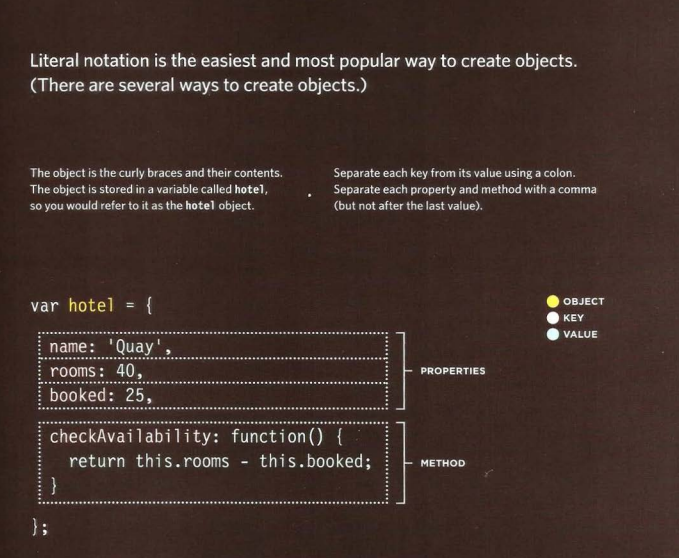

### Accessing an object and DOT notation

  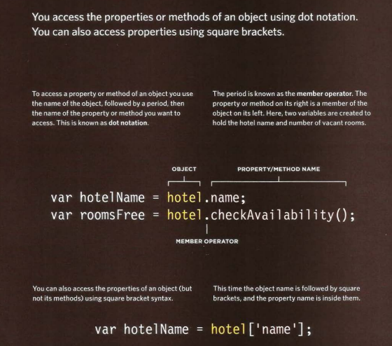

### CREATING· OBJECTS USING LITERAL NOTATION

  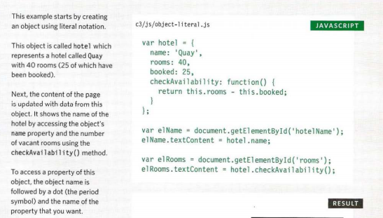

### CREATING MORE OBJECT LITERALS

  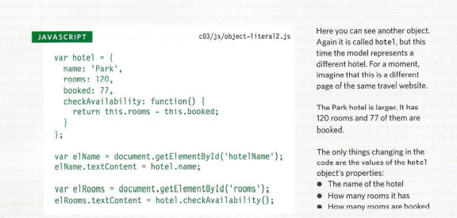

## Document object model

The Document Object Model (DOM) specifies how browsers should create a model of an HTML page and how JavaScript can access and update the contents of a web page while it is in the browser window.

The DOM is neither part of HTML, nor part of JavaScript; it is a separate set of rules. It is implemented by all major browser makers, and covers two primary areas:

1. MAKING A MODEL OF THE HTM L PAGE when the browser loads a web page, it creates a model of the page in memory. The DOM specifies the way in which the browser should structure this model using a DOM tree.

2. ACCESSING AND CHANGING THE HTML PAGE The DOM also defines methods and properties to access and update each object in this model, which in turn updates what the user sees in the browser.

### THE DOM TREE IS A MODEL OF A WEB PAGE

As a browser loads a web page, it creates a model of that page. The model is called a DOM tree, and it is stored in the browsers' memory. It consists of four main types of nodes.

Each node is an object with methods and properties. Scripts access and update this DOM tree (not the source HTML file). Any changes made to the DOM tree are reflected in the browser.

  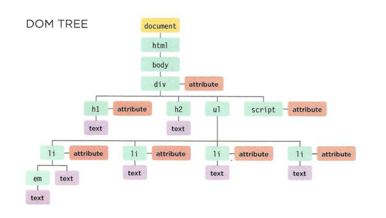

### WORKING WITH THE DOM TREE

Accessing and updating the DOM tree involves two steps: 

1. Locate the node that represents the element you want to work with. 

2. Use its text content, child elements, and attributes.

  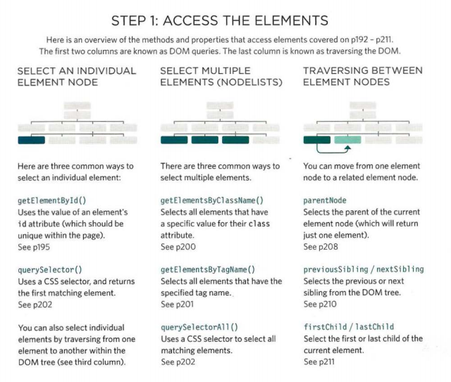

  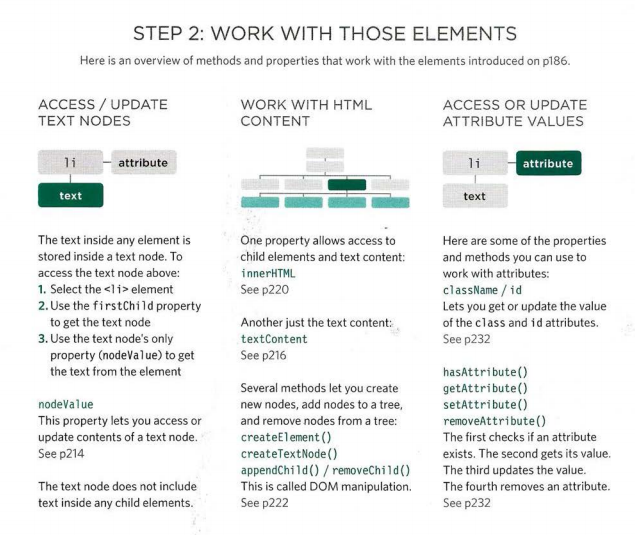

### ACCESSING ELEMENTS

DOM queries may return one element, or they may return a Node list, which is a collection of nodes.

**GROUPS OF ELEMENT NODES** if a method can return more than one node, it will always return a Node list, which is a collection of nodes (even if it only finds one matching element). You then need to select the element you want from this list using an index number (which means the numbering starts at 0 like the items in an array).

**FASTEST ROUTE** finding the quickest way to access an element within your web page will make the page seem faster and/or more responsive. This usually means evaluating the minimum number of nodes on the way to the element you want to work with.

***METHODS THAT RETURN A SINGLE ELEMENT NODE:***

1. Get Element By ld. ( 1 id 1 ) Selects an individual element given the value of its i d attribute . The HTML must have an id attribute in order for it to be selectable.

2. Query Selector ( 1 css selector') Uses CSS selector syntax that would select one or more elements . This method returns only the first of the matching elements.

***METHODS THAT RETURN ONE OR MORE ELEMENTS (AS A NODELIST):***

1. Get Elements By Class Name ( 1 class 1 ) Selects one or more elements given the value of their cl ass attribute. The HTML must have a cl ass attribute for it to be selectable. This method is faster than query Se1ectorA11 () .

2. Get Elements By Tag Name ( 1 tagName 1 ) Selects all elements on the page with the specified tag name. This method is faster than querySelectorA11 ().

3. Query Selector All ( 1 css select or•) Uses CSS selector syntax to select one or more elements and returns all of those that match.

### NODELISTS: DOM QUERIES THAT RETURN MORE THAN ONE ELEMENT

When a DOM method can return more than one element, it returns a Node list (even if it only finds one matching element).

A Node list is a collection of element nodes. Each node is given an index number (a number that starts at zero, just like an array).

The order in which the element nodes are stored in a Node List is the same order that they appeared in the HTML page.

Here you can see four different DOM queries that all return a Nodelist. For each query, you can see the elements and their index numbers in the Nodelist that is returned.

  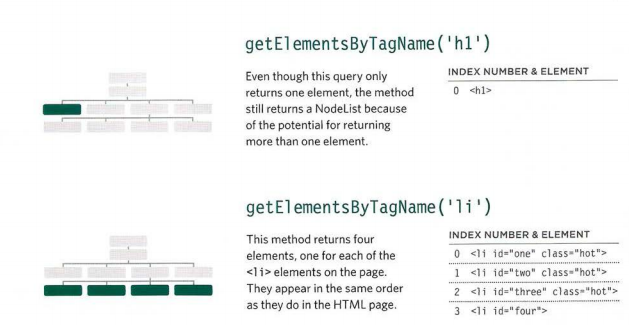

  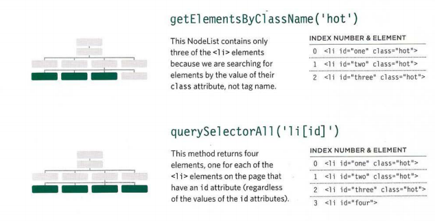

### SELECTI NG ELEMENTS USING CLASS ATTRIBUTES

  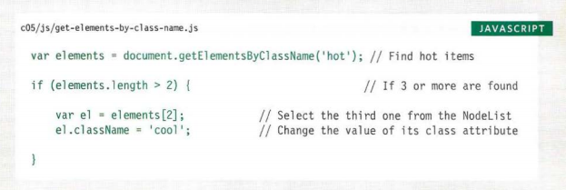

### LOOPING THROUGH A NODELIST

If you want to apply the same code to numerous elements, looping through a Node list is a powerful technique.
It involves finding out how many items are in the Node list, and then setting a counter to loop through them, one-by-one.

  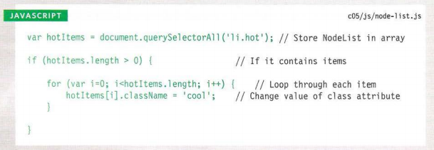

### TRAVERSING THE DOM

When you have an element node, you can select another element in relation to it using these five properties. This is known as traversing the DOM.

1. Parent Node This property finds the element node for the containing (or parent) element in the HTML.

2. Previous Sibling next Sibling these properties find the previous or next sibling of a node if there are siblings.

3. First Child last Child these properties find the first or last child of the current element.

### WHITESPACE NODES

Traversing the DOM can be difficult because some browsers add a text node whenever they come across whitespace between elements.