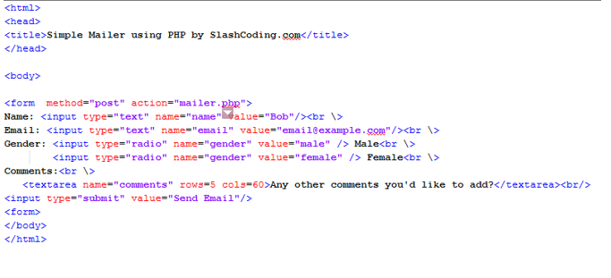

# Forms and Events

## Forms:

Form is the search box that put in the middle of google homepage and allow user to perform other function online.

### Form Controls:

1. Adding Text.

2. Making Choices.

3. Submitting Forms.

4. Uploading Files.

### Form Structure:

•using (form) element which contain action attribute(its value is the URL for the page on the server) and have a method(get or post) and id attribute.

### How Forms Work:

•The user fills in a form and then presses a button to pass the information to the server.

•A form may have several form controls to get different information.

### Text and password Input:

* using (input) element to create several different form controls .the value of (type)attribute specifies the kind of input.and the (name) of form. type (text or password).

* (textarea) element to create multi-line text input.

* (type="radio") allow user to pick one of number options.

* (type="checkbox) allow user to select one or more options.

* (type="file")allow user to upload a file.

* (type="submit") send a form to the server.

* (type="image") to use image for the submit button.

* (type="date") ask the user for a date.

* (type="email") ask user for an email adress.

### Example:

  

### Table Properties:

1. width

2. padding

3. text-transform

4. letter-spacing, font-size

5. border-top, border-bottom

6. text-align

7. background-color

### Web Delevepor Toolbar:

* tools in firefox and chrome to show CSS styles of element.

**view style information :**

1. Outlines

2. Structure

3. CSS style

## Events:

HTML events are "things" that happen to HTML elements. When JavaScript is used in HTML pages, JavaScript can "react" on these events.

### Ul Events:

1. load

2. unload

3. error

4. resize

5. scroll

### Keyboard Events:

1. keydown

2. keyup

3. keypress

### Mouse Events:

1. click

2. dblclick

3. mousedown

4. mouseup

5. mousemove

6. mouseover

7. mouseout

### Event handling Steps:

1. select the element nodes.
2. indicate which event will trigger the response.
3. state the code to run when event occurs.

**Example:** element .onevent = functionName ;

### Event Flow:

HTML elements nest inside other elements.if you click on a link, you also will clicking on it's parent.
Events Type:

1. W3C Dom Events

2. HTML5 Events

3. Bom Events

### User Interface Event:

occure as a result of interaction with the browser window.
Form Events:

1. Event Trigger(Submit,change)
2. Focus And Blur
3. Validation
