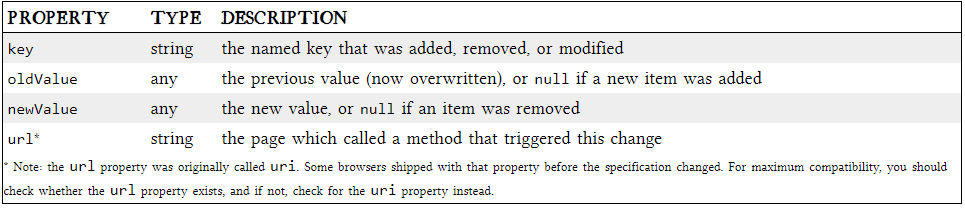

# Local Storage

## INTRODUCING HTML5 STORAGE

What I will refer to as “HTML5 Storage” is a specification named Web Storage, which was at one time part of the HTML5 specification proper, but was split out into its own specification for uninteresting political reasons. Certain browser vendors also refer to it as “Local Storage” or “DOM Storage.” The naming situation is made even more complicated by some related, similarly-named, emerging standards that I’ll discuss later in this chapter.

## USING HTML5 STORAGE

HTML5 Storage is based on named key/value pairs. You store data based on a named key, then you can retrieve that data with the same key. The named key is a string. The data can be any type supported by JavaScript, including strings, Booleans, integers, or floats. However, the data is actually stored as a string. If you are storing and retrieving anything other than strings, you will need to use functions like parseInt() or parseFloat() to coerce your retrieved data into the expected JavaScript datatype.

Calling setItem() with a named key that already exists will silently overwrite the previous value. Calling getItem() with a non-existent key will return null rather than throw an exception.

Like other JavaScript objects, you can treat the localStorage object as an associative array. Instead of using the getItem() and setItem() methods, you can simply use square brackets.

There are also methods for removing the value for a given named key, and clearing the entire storage area (that is, deleting all the keys and values at once).

Finally, there is a property to get the total number of values in the storage area, and to iterate through all of the keys by index (to get the name of each key).

## TRACKING CHANGES TO THE HTML5 STORAGE AREA

If you want to keep track programmatically of when the storage area changes, you can trap the storage event. The storage event is fired on the window object whenever setItem(), removeItem(), or clear() is called and actually changes something. For example, if you set an item to its existing value or call clear() when there are no named keys, the storage event will not fire, because nothing actually changed in the storage area.

## STORAGEEVENT OBJECT

## LIMITATIONS IN CURRENT BROWSERS

“5 megabytes” is how much storage space each origin gets by default. This is surprisingly consistent across browsers, although it is phrased as no more than a suggestion in the HTML5 Storage specification. One thing to keep in mind is that you’re storing strings, not data in its original format. If you’re storing a lot of integers or floats, the difference in representation can really add up. Each digit in that float is being stored as a character, not in the usual representation of a floating point number.

“QUOTA_EXCEEDED_ERR” is the exception that will get thrown if you exceed your storage quota of 5 megabytes. “No” is the answer to the next obvious question, “Can I ask the user for more storage space?” At time of writing (February 2011), no browser supports any mechanism for web developers to request more storage space. Some browsers (like Opera) allow the user to control each site’s storage quota, but it is purely a user-initiated action, not something that you as a web developer can build into your web application.

## BEYOND NAMED KEY-VALUE PAIRS: COMPETING VISIONS

While the past is littered with hacks and workarounds, the present condition of HTML5 Storage is surprisingly rosy. A new API has been standardized and implemented across all major browsers, platforms, and devices. As a web developer, that’s just not something you see every day, is it? But there is more to life than “5 megabytes of named key/value pairs,” and the future of persistent local storage is… how shall I put it… well, there are competing visions.

One vision is an acronym that you probably know already: SQL. In 2007, Google launched Gears, an open source cross-browser plugin which included an embedded database based on SQLite. This early prototype later influenced the creation of the Web SQL Database specification. Web SQL Database (formerly known as “WebDB”) provides a thin wrapper around a SQL database, allowing you to do things  from JavaScript.

Of course, if you’ve used more than one database product in your life, you are aware that “SQL” is more of a marketing term than a hard-and-fast standard. (Some would say the same of “HTML5,” but never mind that.) Sure, there is an actual SQL specification (it’s called SQL-92), but there is no database server in the world that conforms to that and only that specification. There’s Oracle’s SQL, Microsoft’s SQL, MySQL’s SQL, PostgreSQL’s SQL, and SQLite’s SQL. Indeed, each of these products adds new SQL features over time, so even saying “SQLite’s SQL” is not sufficient to pin down exactly what you’re talking about. You need to say “the version of SQL that shipped with SQLite version X.Y.Z.”